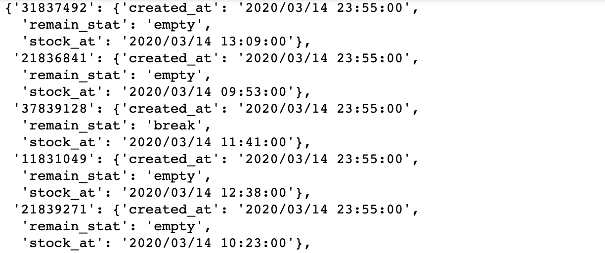

# Korea_Public_Mask_Store_Visualization
마스크 공적판매처 위치 지도 시각화

### 사용 API
- 공공데이터 포털- 건강보험심사평가원_공적마스크 판매정보
- API 링크 : https://www.data.go.kr/dataset/15043025/openapi.do
- API 명세서 : https://app.swaggerhub.com/apis-docs/Promptech/public-mask-info/20200307-oas3#/

### 사용 라이브러리
- requests
- json
- pandas
- folium

### 세부 설명 - https://bit.ly/2Qfkshn

### getMaskStoreInfo()
- 전체 공적 판매처 데이터를 받아오는 함수
- DataFrame형식으로 return 함

  

### getMaskStoreSalesInfo()
- 전체 공적 판매처 마스크 재고현황을 받아오는 함수
- 공적판매처 code를 key값으로 하는 Dictionary를 return 함

  

### mergeSalesInfobyStoreCode(sales_dict, my_info_df)
- sales_dict : getMaskStoreSalesInfo() 에서 얻은 Dictionary
- my_info_df : getMaskStoreInfo()에서 얻은 DataFrame
- my_info_df의 code값을 key값으로 활용하여 sales_dict에서 재고 데이터를 얻고 my_info_df에 추가하는 함수

### getNearMaskStoreInfo(address)
- address : "서울특별시 동작구" 와 같은 시군구 주소정보
- 입력한 주소에 있는 공적 판매처 정보를 받아오는 함수

### getNearMaskStoreInfoByGeo(lat, lng, m)
- lat : 위도
- lng : 경도
- m : 반경 m 미터
- 입력한 위도와 경도를 기준으로 반경 m 미터 안에있는 공적 판매처 정보를 받아오는 함수
